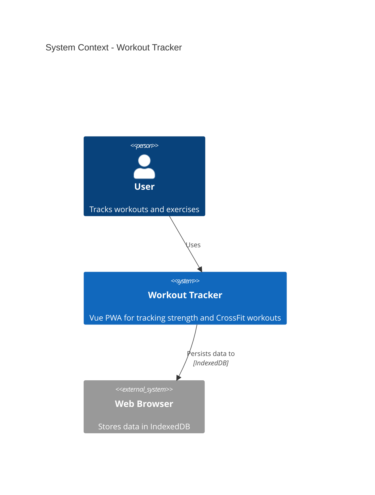
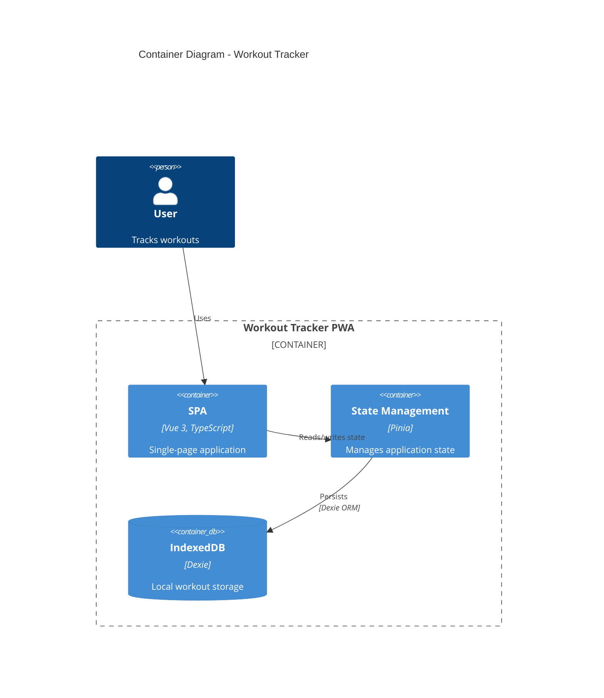
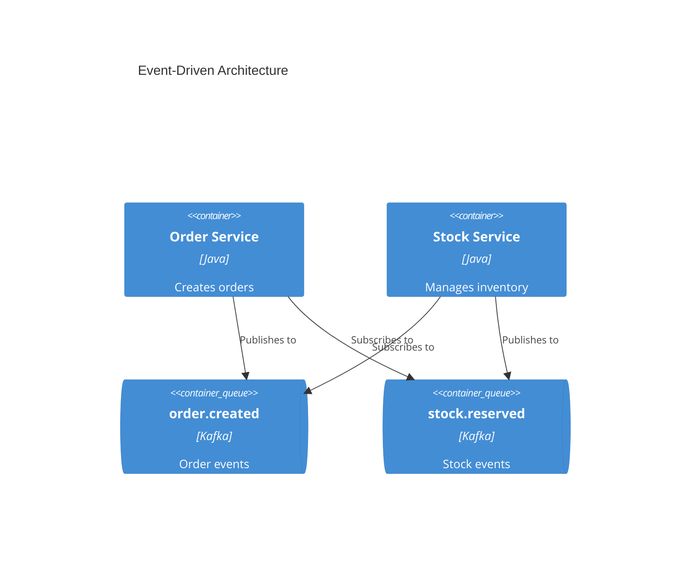

# C4 Architecture Documentation

Generate software architecture documentation using C4 model diagrams in Mermaid syntax.

## Mindset

Expert C4 practitioners think in these terms — not in diagram syntax:

1. **Audience first, diagram second.** The question is never "which diagram type?" — it is "who needs to understand what, and what do they already know?" Context diagrams for executives; Container + Deployment for DevOps; Component only when a developer is lost navigating the codebase.

2. **Containers are deployment units, not logical groupings.** If you cannot `docker run` it, `kubectl apply` it, or deploy it independently, it is a Component — not a Container. Misclassifying this one thing causes 80% of C4 diagram confusion.

3. **Stop at the level that answers the question.** Creating Level 3 Component diagrams "just in case" adds maintenance burden with no clarity gain. Context + Container diagrams are sufficient for most teams.

4. **Name relationships with verb phrases, not nouns.** "Reads customer data from" is better than "Database connection". Relationships carry meaning; labels are not decoration.

5. **Diagram sprawl is worse than no diagram.** One accurate Context diagram beats ten stale Component diagrams. Keep diagrams minimal enough that they stay current.

## Navigation

**Use this skill when:**
- Asked to document, visualize, or diagram system architecture
- Onboarding new engineers who need a map of the system
- Planning a new system or major feature and need to communicate design
- Performing architecture review and need a baseline

**Do NOT use this skill when:**
- The user wants a sequence diagram for a single request flow → use a standard Mermaid sequence diagram instead
- The user wants an entity-relationship diagram → use Mermaid `erDiagram`
- The user wants a network topology diagram with physical hardware detail → use a deployment diagram only if C4 conventions fit, otherwise note the limitation

### Decision Tree: Which level(s) to generate?

```
Start: Who is the primary audience?
│
├─ Non-technical (executives, product) → Level 1 ONLY (C4Context)
│
├─ Technical but not hands-on (architects, TPMs) → Level 1 + Level 2 (C4Container)
│
├─ Developers unfamiliar with the codebase → Level 1 + Level 2 + Level 3 for the specific area in question (C4Component)
│
├─ DevOps / SRE / infra → Level 2 + Level 4 (C4Container + C4Deployment)
│
└─ Complex async workflow needs explaining → Add C4Dynamic for that flow only
```

### Decision Tree: How to model microservices ownership?

```
Microservice owned by...
│
├─ Same team as the system being documented → model as Container inside a System_Boundary
│
└─ Different team → model as System_Ext at Level 1; only expand to Container in that team's own diagram
```

### Decision Tree: How to model a message broker (Kafka, RabbitMQ, SQS)?

```
Does the diagram need to show data flows?
│
├─ Yes → show individual topics/queues as ContainerQueue elements; do NOT show "Kafka" as a single box
│
└─ No (just showing system exists) → single System or Container named for the broker is acceptable
```

## Philosophy

The C4 model's power is that each level answers exactly one question for one audience — the moment a diagram tries to answer two questions, it fails both. Generate diagrams at the lowest level of abstraction that resolves the audience's actual question.

## Workflow

1. **Identify audience and question** — determine who will read this and what decision it supports
2. **Select level(s)** — use the decision trees above; default to Level 1 + Level 2 only
3. **Analyze codebase** — identify containers, external systems, and key relationships
4. **Generate diagrams** — write Mermaid C4 diagrams at selected levels
5. **Document** — write to `docs/architecture/` with standard naming (see Output Location)

## Quick Start Examples

### System Context (Level 1)


### Container Diagram (Level 2)


### Event-Driven Architecture (Kafka/queues)


> Full syntax for all element types, styling, and layout: [references/c4-syntax.md](references/c4-syntax.md)

## NEVER

- **NEVER model a Java/Python class or module as a Container.** Containers are independently deployable. Misclassifying creates diagrams that look technical but communicate nothing — developers will correctly distrust them.
- **NEVER show a message broker (Kafka, RabbitMQ) as a single container when data flows matter.** A "Kafka" box hides which services are coupled to which topics — the exact information the diagram needs to convey.
- **NEVER create Component diagrams without a specific developer question driving them.** Component diagrams become stale within weeks of code changes; they cost more to maintain than they save unless targeting a specific navigation problem.
- **NEVER use bidirectional arrows (`BiRel`) as a default.** Most relationships have a initiator and a responder. `BiRel` signals "I wasn't sure" and destroys the ability to trace data flows through the diagram.
- **NEVER label relationships with nouns alone** (e.g., "API", "Database"). Noun-only labels make the diagram look complete while conveying nothing. Always use a verb phrase: "Submits orders via", "Reads config from".
- **NEVER put implementation detail (method names, SQL queries, config keys) in a C4 diagram.** C4 diagrams communicate structure and intent at a business-meaningful level; implementation belongs in code comments and ADRs.
- **NEVER remove type labels from elements to "simplify" the diagram.** The technology label (e.g., "PostgreSQL", "React") is load-bearing — it tells the reader what kind of thing this is and what constraints apply.

## When Things Go Wrong

| Symptom | Likely cause | Fix |
|---------|-------------|-----|
| Mermaid renders a blank diagram | Missing diagram type keyword (`C4Context`, `C4Container`, etc.) or syntax error in element line | Validate each line; check that all `{` boundaries are closed |
| Diagram is unreadably crowded | Too many elements at one level | Split: use `System_Ext` to collapse external systems; create separate diagram per bounded context |
| Reviewers argue about what counts as a "container" | Mixing deployable units with logical groupings | Reframe: "can this be restarted/scaled independently?" — yes = Container, no = Component |
| Event-driven system looks like spaghetti | Showing broker as single node with many arrows | Replace single broker box with individual `ContainerQueue` elements per topic; group by owning service |
| Multi-team microservices diagram is unnavigable | All services at same level regardless of ownership | Apply ownership decision tree: cross-team services become `System_Ext` at Level 1 |

## Output Location

Write architecture documentation to `docs/architecture/` with naming convention:
- `c4-context.md` — System context diagram
- `c4-containers.md` — Container diagram
- `c4-components-{feature}.md` — Component diagrams per feature
- `c4-deployment.md` — Deployment diagram
- `c4-dynamic-{flow}.md` — Dynamic diagrams for specific flows

## Audience-Appropriate Detail

| Audience | Recommended Diagrams |
|----------|---------------------|
| Executives | System Context only |
| Product Managers | Context + Container |
| Architects | Context + Container + key Components |
| Developers | All levels as needed |
| DevOps | Container + Deployment |

## References

- [references/c4-syntax.md](references/c4-syntax.md) — Complete Mermaid C4 syntax (all element types, boundaries, relationships, styling, layout)
- [references/common-mistakes.md](references/common-mistakes.md) — Anti-patterns with corrected examples
- [references/advanced-patterns.md](references/advanced-patterns.md) — Microservices, event-driven, multi-team, deployment patterns
