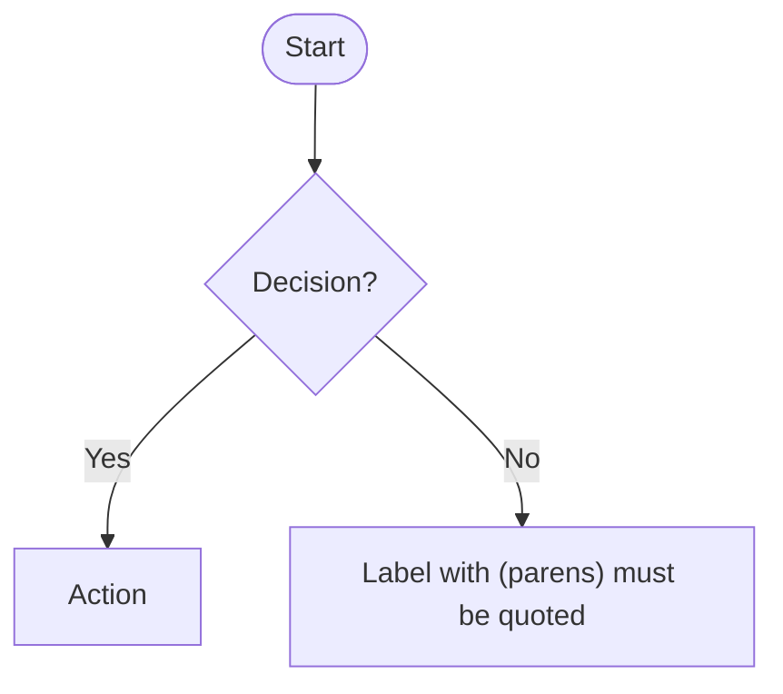
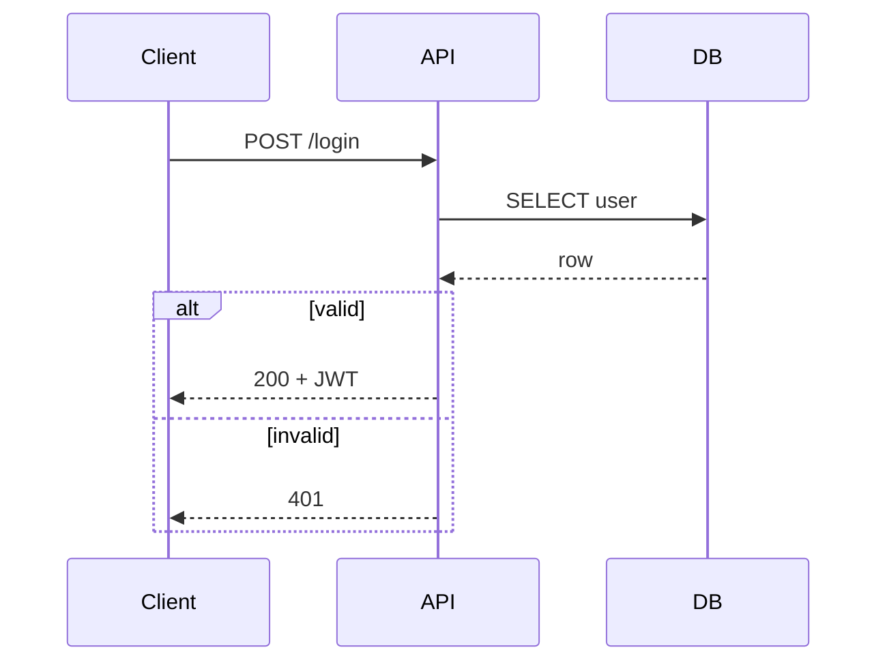
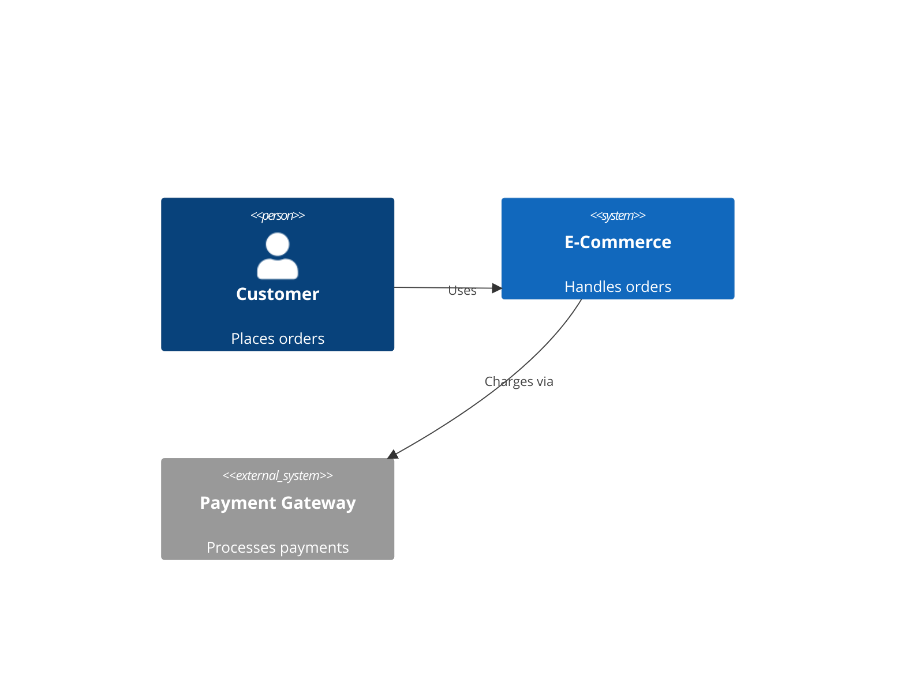

## Mindset

**Diagram type is architecture, not aesthetics.** Choosing `flowchart` vs `sequenceDiagram` vs `C4Context` determines what relationships are even expressible — pick wrong and you'll fight the syntax the whole way.

**Mermaid is a parse-then-render pipeline.** Errors are silent or cryptic. A diagram that "almost works" often renders completely blank. Test in [mermaid.live](https://mermaid.live) before embedding.

**Complexity compounds exponentially.** A 10-node diagram is readable. A 20-node diagram needs subgraphs. A 30-node diagram needs to be three diagrams.

**The renderer you target matters more than the syntax.** GitHub strips `%%{init}%%` directives. GitLab supports `elk` layout. VS Code preview differs from CLI output. Know your render target first.

**Labels are the hardest part.** The diagram structure is usually obvious; naming relationships precisely enough to be unambiguous is the real design work.

## Navigation

**Use this skill when**: creating any Mermaid syntax diagram, selecting between diagram types, fixing broken Mermaid syntax, advising on diagram scope/splitting, rendering for CI/CD pipelines (mmdc CLI).

**Do NOT use this skill when**: user wants PlantUML, draw.io XML, Lucidchart, or Graphviz DOT syntax — those are different languages entirely.

**Diagram type decision tree:**

```
What are you capturing?
├── Interactions OVER TIME between actors → sequenceDiagram
├── State changes of a single entity → stateDiagram-v2
├── CLASS/type structure (OOP, domain model) → classDiagram
├── Database tables and FK relationships → erDiagram
├── A PROCESS with decisions/branches → flowchart TD/LR
├── System/service landscape (who talks to what) → C4Context or C4Container
├── Version control branching strategy → gitGraph
└── Project schedule / milestones → gantt
```

**Sequence vs Flowchart ambiguity**: If you're tempted to put timestamps or "then" in every step, use `sequenceDiagram`. If you're tempted to put actors in diamond shapes, use `flowchart`.

**C4 level selection**:
- Stakeholder briefing or "what does our system do?" → `C4Context`
- "What services/databases exist?" → `C4Container`
- "How is service X structured internally?" → `C4Component`
- Don't use `C4Dynamic` unless you explicitly need numbered sequence steps with C4 notation

For audience-driven C4 level selection, container vs. component decisions, and multi-team ownership patterns, load the c4-architecture skill alongside this one.

For requirements-gathering that produces diagrams, sequence mermaid-diagrams after requirements-clarity to ensure diagram vocabulary matches the finalized requirement terms.

## Philosophy

The diagram exists to transfer a mental model, not to be comprehensive. Every element you add competes with every other element for the reader's attention. Ruthless pruning is a feature, not laziness.

## NEVER

- **NEVER use special characters `{}`, `[]`, `()` inside node label text without quoting** — Mermaid's parser treats them as syntax, not content. Wrap labels in quotes: `A["My (special) label"]`. This is the #1 cause of blank renders.

- **NEVER nest `subgraph` more than 2 levels deep in flowcharts** — the ELK and dagre layout engines both produce overlapping edges at depth 3+, and there is no workaround short of splitting the diagram.

- **NEVER use `C4Context` to show internal component interactions** — C4 relationship arrows represent *dependencies between bounded systems*, not call sequences. Mixing C4 with method-level calls makes both wrong. Use `sequenceDiagram` for call flows.

- **NEVER omit `participant` declarations in sequence diagrams when actor order matters** — Mermaid infers order from first appearance, which is often not the logical order. Explicit `participant A` blocks at the top lock display order.

- **NEVER use `classDiagram` for process flows** — no matter how tempting it is to show "step 1 → step 2" via inheritance arrows, class diagrams express structural relationships, not temporal ones. The reader will misread it as inheritance.

- **NEVER pass `--no-sandbox` directly to mmdc CLI** — it is not a valid flag in mmdc v11+. Pass it via `-p puppeteer.json` with `{"args":["--no-sandbox","--disable-setuid-sandbox"]}`. Direct flag use silently produces no output.

- **NEVER use `graph` instead of `flowchart`** — `graph` is the deprecated alias. It lacks `look:`, `layout:`, and subgraph click handlers. Always use `flowchart TD` or `flowchart LR`.

## When Things Go Wrong

| Situation | Likely Cause | Recovery |
|-----------|-------------|----------|
| Diagram renders blank with no error | Special char in label (`()`, `{}`, `&`); or parser keyword used as node name (`end`, `style`, `classDef`) | Wrap all labels in double-quotes; rename node IDs |
| `mmdc` produces empty PNG/SVG file | Puppeteer sandboxing; missing `puppeteer.json` | Add `-p puppeteer.json` with `{"args":["--no-sandbox"]}` |
| GitHub renders diagram, GitLab does not | Diagram uses `%%{init}` which GitLab's renderer may reject | Move config to frontmatter YAML block (`---\nconfig:\n  theme: dark\n---`) |
| Arrow labels truncated or overlapping | Long edge labels in dagre layout | Switch to `layout: elk` via frontmatter, or shorten labels |
| `sequenceDiagram` actors in wrong order | Order inferred from first message | Add explicit `participant X` declarations at top before any messages |
| `erDiagram` relationship line missing | Attribute block uses a type keyword Mermaid doesn't recognize | Stick to `string`, `int`, `float`, `boolean`, `date`, `datetime` as attribute types |

## Diagram Type References

Load the relevant reference only when you need syntax details beyond what you know:

| Diagram | When to load | File |
|---------|-------------|------|
| Class diagrams | Multiplicity, visibility modifiers, lollipop interfaces | `references/class-diagrams.md` |
| Sequence diagrams | `loop`/`alt`/`opt`/`par` blocks, activation bars, notes | `references/sequence-diagrams.md` |
| Flowcharts | Node shapes, styling, `click` handlers, subgraph links | `references/flowcharts.md` |
| ERD | Cardinality notation, attribute types, relationship labels | `references/erd-diagrams.md` |
| C4 diagrams | `C4Container`, `C4Component`, boundary blocks | `references/c4-diagrams.md` |
| Architecture / infra | Cloud service icons, CI/CD pipeline patterns | `references/architecture-diagrams.md` |
| Theming / CLI export | `themeVariables`, mmdc flags, `look: handDrawn` | `references/advanced-features.md` |

## Quick Syntax Reference





```mermaid
%% ERD — stick to known attribute types
erDiagram
    USER ||--o{ ORDER : places
    USER { int id PK; string email UK }
    ORDER { int id PK; int user_id FK; decimal total }
```



## mmdc CLI (Local Rendering)

```bash
# Install
npm install -g @mermaid-js/mermaid-cli

# puppeteer.json — required for sandbox environments
echo '{"args":["--no-sandbox","--disable-setuid-sandbox"]}' > puppeteer.json

# Render
mmdc -i diagram.mmd -o diagram.png -p puppeteer.json
mmdc -i diagram.mmd -o diagram.svg -p puppeteer.json

# Batch render all .mmd files
for f in *.mmd; do mmdc -i "$f" -o "${f%.mmd}.png" -p puppeteer.json; done
```
